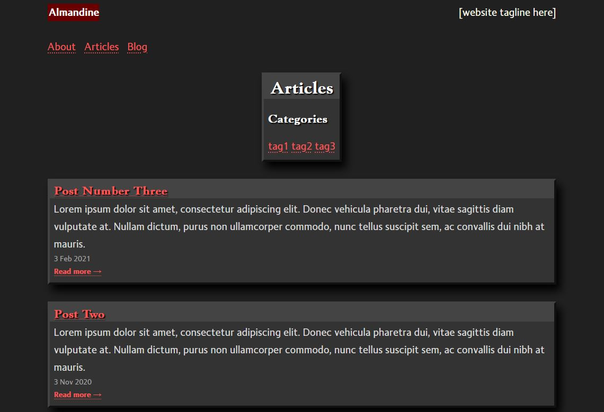

# Almandine Theme for Hugo

This is my first ever Hugo theme! I'm still learning, and it's a work in progress. 



## Goals 

- Accessibility first; screen-reader friendly
- Single-column layout 
- Minimal card-based look
- No JavaScript

## Features 

- Mobile friendly CSS
- Support "All" list, which lists post from every section
- Tags are unique per section 
- Collapsible table of contents
- Comes with several useful shortcodes 
- Localization support (you can configure it for multiple languages) 
- "Jump to Top" convenience link in footer 

## Installation

Inside your project folder, clone `almandine` to your `themes` folder. 
Then delete the `.git` file. 

```bash
git clone https://github.com/k3rs3d/almandine/
rm -rf themes/almandine/.git
```

